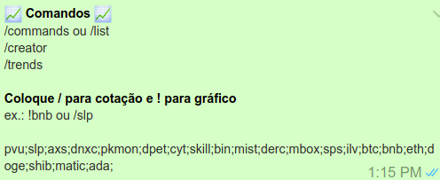

<br />
<p align="center">
  <h3 align="center">Whats Crypto Bot</h3>
  <p align="center">
    Whats Crypto Bot is a cryptocurrency price quote robot running on a Chrome Extension. It can listen to commands sent in whatsapp groups and conversations and respond with current currency rate. Check the images below to understand better.
    <br />
    <br />
    <a href="https://github.com/xandao6/whats-crypto-bot"><strong>Explore the docs »</strong></a>
    <br />
    <a href="https://github.com/xandao6/whats-crypto-bot/issue">Report Bug</a>
    ·
    <a href="https://github.com/xandao6/whats-crypto-bot/issues">Request Feature</a>
  </p>
</p>


<!-- TABLE OF CONTENTS -->
<details open="open">
  <summary>Table of Contents</summary>
  <ol>
    <li>
      <a href="#about-the-project">About The Project</a>
      <ul>
        <li><a href="#features">Features</a></li>
        <li><a href="#built-with">Built With</a></li>
      </ul>
    </li>
    <li>
      <a href="#getting-started">Getting Started</a>
      <ul>
        <li><a href="#installation">Installation</a></li>
      </ul>
    </li>
    <li><a href="#usage">Usage</a></li>
    <li><a href="#roadmap">Roadmap</a></li>
    <li><a href="#contributing">Contributing</a></li>
    <li><a href="#license">License</a></li>
    <li><a href="#contact">Contact</a></li>
  </ol>
</details>


<!-- ABOUT THE PROJECT -->
## About The Project

<div align="center">
  <a href="https://github.com/xandao6/whats-crypto-bot">
    
  </a>
	
https://user-images.githubusercontent.com/22106326/150383534-27de4827-bd12-46bb-87cd-0f6698673f40.mp4
</div>


### Features

* Get cryptocurrency quotation live on whatsapp
* Get cryptocurrency graph on whatsapp
* Get pre written text on whatsapp 

### Built With

* [Chrome Extension](https://developer.chrome.com/docs/extensions/) - Architecture to build Web Extensions for Google Chrome
* [Apex Charts](https://apexcharts.com/) - Modern & Interactive Open-source Charts
* [CoinGecko API](https://www.coingecko.com/en/api/) - A cryptocurrency prices API


<!-- GETTING STARTED -->
## Getting Started

To get a local copy up and running follow these simple steps.

### Installation

1. Clone the repo
   ```sh
   git clone https://github.com/xandao6/whats-crypto-bot.git
   ```
2. Install Extension on Chrome

    1. Open Chrome Extensions Website: chrome://extensions/
    2. Click in "Load unpacked"
    3. Select the whats-crypto-bot folder

<!-- USAGE EXAMPLES -->
## Usage

  1. Open your whatsapp web
  2. Select a group or a conversation
  3. Click in the extension on Chrome top bar
  4. Mark the boxes to enable the bot
  5. Type "/commands" on whatsapp to see the command list
  6. Have fun

<!-- ROADMAP -->
## Roadmap

See the [open issues](https://github.com/xandao6/whats-crypto-bot/issues) for a list of proposed features (and known issues).


<!-- CONTRIBUTING -->
## Contributing

Contributions are what make the open source community such an amazing place to be learn, inspire, and create. Any contributions you make are **greatly appreciated**.

1. Fork the Project
2. Create your Feature Branch (`git checkout -b feature/AmazingFeature`)
3. Commit your Changes (`git commit -m 'Add some AmazingFeature'`)
4. Push to the Branch (`git push origin feature/AmazingFeature`)
5. Open a Pull Request

<!-- LICENSE -->
## License

Distributed under the MIT License. See [LICENSE](./LICENSE.md) for more information.

Free software =)


<!-- CONTACT -->
## Contact

Alexandre Calil - [@xandao6](https://www.linkedin.com/in/xandao6/) - alexandrecalilmf@gmail.com

Project Link: [https://github.com/xandao6/whats-crypto-bot](https://github.com/xandao6/whats-crypto-bot)


<!-- LINKS & IMAGES Variables-->
<!-- https://www.markdownguide.org/basic-syntax/#reference-style-links -->
[contributors-shield]: https://img.shields.io/github/contributors/xandao6/repo.svg?style=for-the-badge
[contributors-url]: https://github.com/xandao6/repo/graphs/contributors
[forks-shield]: https://img.shields.io/github/forks/xandao6/repo.svg?style=for-the-badge
[forks-url]: https://github.com/xandao6/repo/network/members
[stars-shield]: https://img.shields.io/github/stars/xandao6/repo.svg?style=for-the-badge
[stars-url]: https://github.com/xandao6/repo/stargazers
[issues-shield]: https://img.shields.io/github/issues/xandao6/repo.svg?style=for-the-badge
[issues-url]: https://github.com/xandao6/repo/issues
[license-shield]: https://img.shields.io/github/license/xandao6/repo.svg?style=for-the-badge
[license-url]: https://github.com/xandao6/repo/blob/master/LICENSE.txt
[linkedin-shield]: https://img.shields.io/badge/-LinkedIn-black.svg?style=for-the-badge&logo=linkedin&colorB=555
[linkedin-url]: https://linkedin.com/in/xandao6
